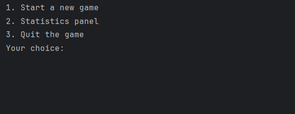
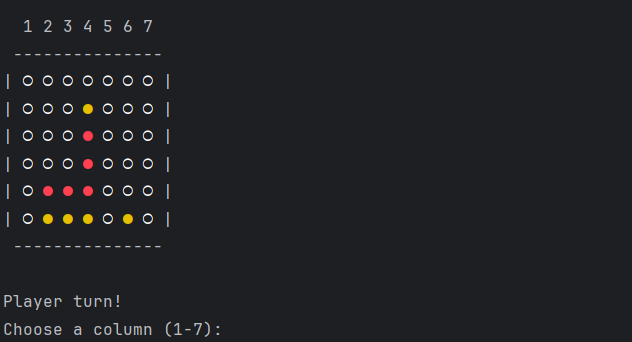
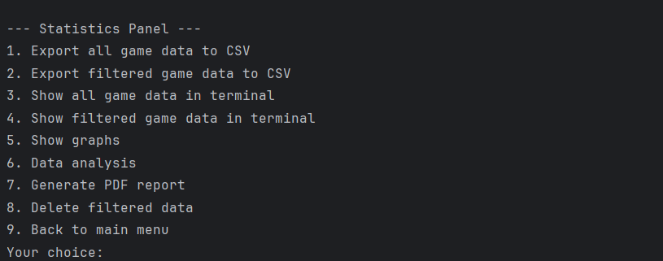
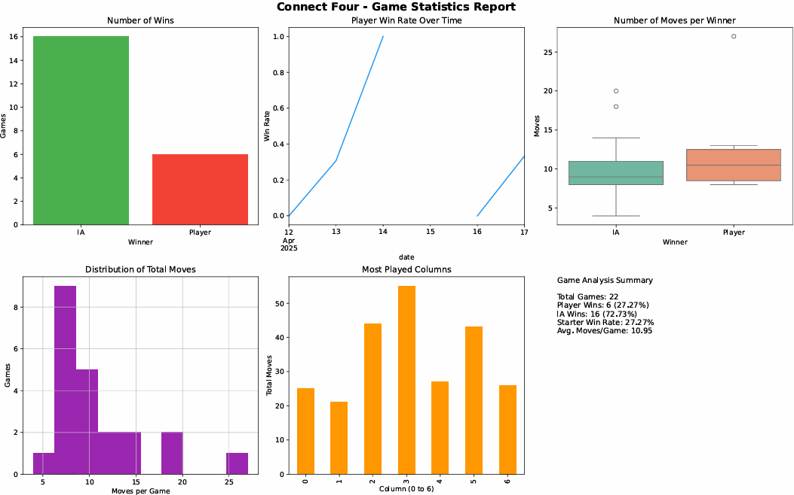
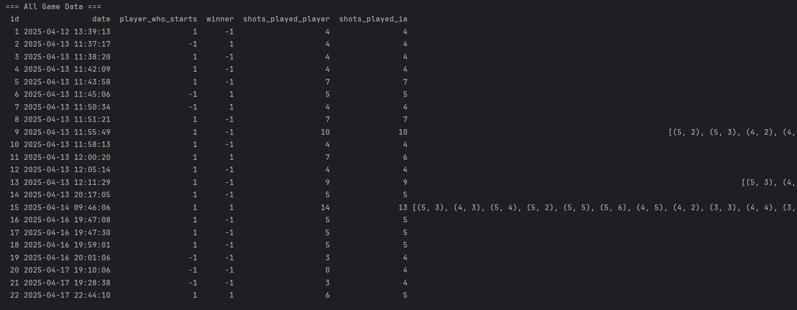

# Connect Four Game

This project is a Connect Four game implemented in Python. It includes a game board, AI opponent, data storage for game history, and various utilities for game management and analysis.
## Features

- Game Board: Manages the game state, including the board, current player, and game logic such as checking for wins and switching players.
- AI Opponent: Implements an AI that makes strategic moves based on the game state.
- Data Storage: Stores game data in a CSV file and provides methods to save, load, and analyze game data.
- Graphics: Generates various graphs based on game data for visual analysis.
- Statistics: Provides statistical analysis of game data, including win rates, average moves, and more.

## Prerequisites
- Python 3.x
- Required libraries: pandas, numpy, matplotlib, seaborn
## Installation

1. Clone the repository:
- git clone <repository_url>
2. Navigate to the project directory:
- cd Puissance4_python 
3. Install the required libraries:
- pip install pandas numpy matplotlib seaborn
    
## Project Structure
The project is structured into several classes and modules:

- Plateau: Manages the game board and game state.
- Player: Represents the human player.
- IA: Represents the AI opponent.
- Database: Manages game data storage and retrieval.
- Graphics: Generates graphs for visual analysis of game data.
- Utils: Contains utility functions for game logic and configuration loading.
## Pictures

### Main Menu

*The main menu where users can start a new game, view statistics, or quit.*

### Gameplay

*The game board during a game session.*

### Statistics Menu

*The statistics menu where users can view various game statistics.*

### Graphs

*Example of a graph generated from game data.*

### Statistics Print

*Example of printed statistics in the terminal.*
## Authors

- [@MelfStudent](https://www.github.com/MelfStudent)
